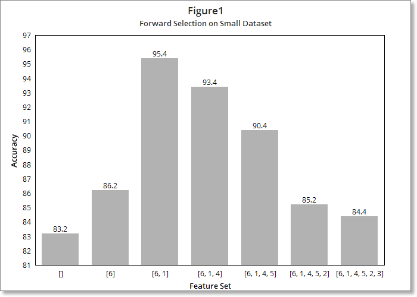
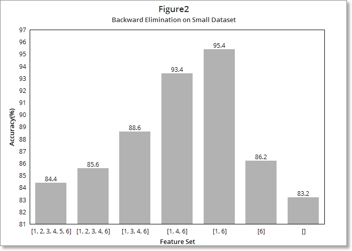
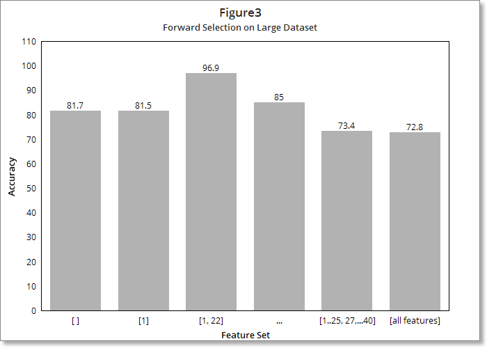
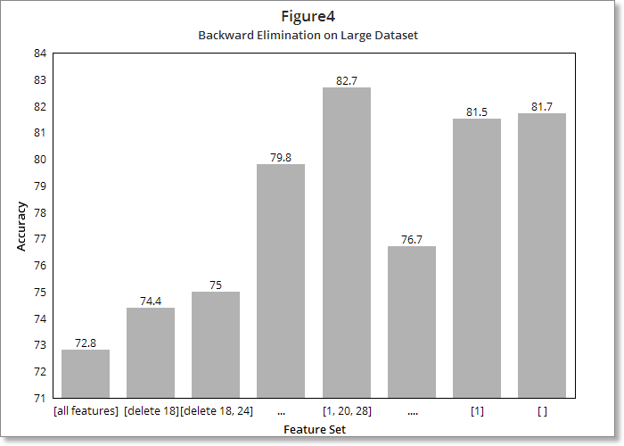
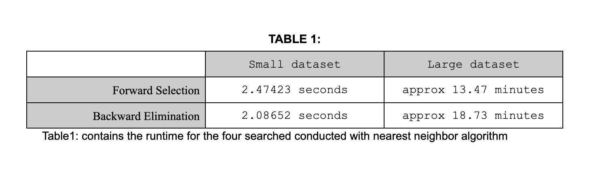

# Feature Selection using Nearest Neighbor algorithm


## About the Code

Assignment 2 for CS170: Intro to Artificial Intelligence at UCR. We were tasked to create a program that would take a given dataset and find the most accurate set of features for it. The intention of this project was to show how different types of feature searches (when used by mixing leave-one-out cross validation with the nearest neighbor classifier algorithm) could be advantageous, depending on the size of the dataset given.

To run the program please typle in ```main.cpp``` which will then allow you to use the GUI interface to enter a dataset and find the most accurate set of features.

## Results

#### EXPERIMENTS ON SMALL DATASET

In Figure 1, we see the result of running forward selection on CS170_Small_Data__50.txt, which was the file assigned to me. 

 \
Figure 1: Accuracy of increasingly large subsets of features discovered by forward selection.


At the beginning of the search, we have no features (denoted by [ ] ) so I reported the default rate, which was 83.2%. Adding feature ‘6’ improved the accuracy to 86.2%, and then adding feature ‘1’, dramatically increased the accuracy to 95.4%. When we then added feature ‘4’, the accuracy decreased, by a small amount, to 93.4%. Because this is just a small loss, I suspect it does not reflect a true useful feature. Thereafter, each additional feature added reduced the accuracy, until we have the full set of features, which gives us an accuracy of 84.4%. 

Next, as shown in Figure 2, I ran backward elimination on CS170_Small_Data__50.txt
 \
Figure 2: Accuracy of increasingly small subsets of features discovered by backward selection


At the beginning of the search, we had all features which were 84.4% accurate. This is the same as the accuracy calculated by the forward  selection algorithm for the set of all features, and hence the observation seems reliable. Deleting feature ‘5’ improved the accuracy to 85.6%, and then deleting feature ‘2’, further increased the accuracy to 88.6%. When we then deleted feature ‘3’, the accuracy increased to 93.4%. 
Deleting feature ‘4’ further increased the accuracy to 95.4%. Thereafter, each additional feature deletion reduced the accuracy, until we have the empty set of features, which gives us an accuracy of 83.2%.


#### Conclusion For Small Dataset: 
I believe that features ‘1’ and ‘6’’ are the best features for this problem. There is very weak evidence that feature ‘4’ might be useful, but that needs further investigation. If we deploy this {1,6} model, I believe the accuracy will be about 95.4%.
 

### EXPERIMENTS ON LARGE DATASET

Next, as shown in Figure 3,  I ran forward selection on CS170_Large_Data__66.txt
 \
Figure 3: Accuracy of increasingly large subsets of features discovered by forward selection


At the beginning of the search, we have no features (denoted by [ ] ) so I reported the default rate, which was 81.7%. Adding feature ‘1’ did not much change the accuracy as it decreased to 81.5%. Adding feature ‘22’ gave us an incredible boost in accuracy, as it increased to  96.9%. Thereafter, each additional feature added reduced the accuracy, until we have the full set of features, which gives us an accuracy of 72.8%. 


Next, as shown in Figure 4, I ran backward elimination on CS170_Large_Data__66.txt
 \
Figure4: Accuracy of increasingly small subsets of features discovered by backward selection


At the beginning of the search, we had all features which were 72.8% accurate. This is the same as the accuracy calculated by the forward  selection algorithm for the set of all features, and hence the observation seems reliable. Deleting feature ‘18’ improved the accuracy to 74.4%, and then deleting feature ‘24’, further increased the accuracy to 75%. There were few minor improvements in accuracy by deleting further features. But when we reached the set of features ‘1, 20, 28’, the accuracy peaked at 82.7%. 
Thereafter, each additional feature deletion reduced the accuracy, until we have the empty set of features, which gives us an accuracy of 81.7%.


#### Conclusion For Large Dataset: 
I found different results for forward and backward elimination for the large dataset, and I found that the backward elimination is not as accurate as forward elimination. However, feature ‘1’ appears for both algorithms. Hence, I believe that features ‘1’ and ‘22’ are good features for this problem. If we deploy this {1,22} model, I believe the accuracy will be about 96.9%.
 


### Computational effort for search:
I implemented the search in C++ (version 11) and ran all experiments on a laptop with an Apple M1 Pro chip and 16 gigs of main memory. In table 1 I report the running time for the four searches I conducted.


##### Traceback
Below I show the search trace for Forward Selection on the small dataset :-

Enter file name: CS170_Small_Data__50.txt
The data has 6 features (not including class label), with 500 instances.
Choose one of the following choices. Enter either '1' or '2' only
1. Forward Selection    2. Backward Elimination

1

On the 1th level of the search tree\
----Consider adding the (1) feature with acc: 0.774 \
----Consider adding the (2) feature with acc: 0.708 \
----Consider adding the (3) feature with acc: 0.696 \
----Consider adding the (4) feature with acc: 0.678 \
----Consider adding the (5) feature with acc: 0.746 \
----Consider adding the (6) feature with acc: 0.862 \
added feature (6)\
--||--CurrentSet:[6] with accuracy 0.862.

On the 2th level of the search tree\
----Consider adding the (1) feature with acc: 0.954\
----Consider adding the (2) feature with acc: 0.828\
----Consider adding the (3) feature with acc: 0.834\
----Consider adding the (4) feature with acc: 0.804\
----Consider adding the (5) feature with acc: 0.852\
added feature (1)\
--||--CurrentSet:[6, 1] with accuracy 0.954.

On the 3th level of the search tree\
----Consider adding the (2) feature with acc: 0.916\
----Consider adding the (3) feature with acc: 0.926\
----Consider adding the (4) feature with acc: 0.934\
----Consider adding the (5) feature with acc: 0.932\
added feature (4)\
--||--CurrentSet:[6, 1, 4] with accuracy 0.934.

On the 4th level of the search tree\
----Consider adding the (2) feature with acc: 0.886\
----Consider adding the (3) feature with acc: 0.886\
----Consider adding the (5) feature with acc: 0.904\
added feature (5)\
--||--CurrentSet:[6, 1, 4, 5] with accuracy 0.904.

On the 5th level of the search tree\
----Consider adding the (2) feature with acc: 0.852\
----Consider adding the (3) feature with acc: 0.846\
added feature (2)\
--||--CurrentSet:[6, 1, 4, 5, 2] with accuracy 0.852.

On the 6th level of the search tree\
----Consider adding the (3) feature with acc: 0.844\
added feature (3)\
--||--CurrentSet:[6, 1, 4, 5, 2, 3] with accuracy 0.844.


The best set of features for the provided dataset is:\
[6, 1]\
with an accuracy of 0.954

--<<Time taken: 2.51165 seconds>>--


The following is the search trace of forward elimination for the Large Dataset. I’ve skipped a few levels of the search to save space:- 

Enter file name: CS170_Large_Data__66.txt
The data has 40 features (not including class label), with 1000 instances.
Choose one of the following choices. Enter either '1' or '2' only
1. Forward Selection    2. Backward Elimination

    1

On the 1th level of the search tree\
added feature (1)\
--||--CurrentSet:[1] with accuracy 0.815.

On the 2th level of the search tree\
added feature (22)\
--||--CurrentSet:[1, 22] with accuracy 0.969.

On the 39th level of the search tree\
added feature (11)\
--||--CurrentSet:[1, 22, 3, …, 24, 11] with accuracy 0.734.

On the 40th level of the search tree\
added feature (26)\
--||--CurrentSet:[1, 22, …, 26] with accuracy 0.728.


The best set of features for the provided dataset is:\
[1, 22]\
with an accuracy of 0.969

--<<Time taken: 808.237 seconds>>--
